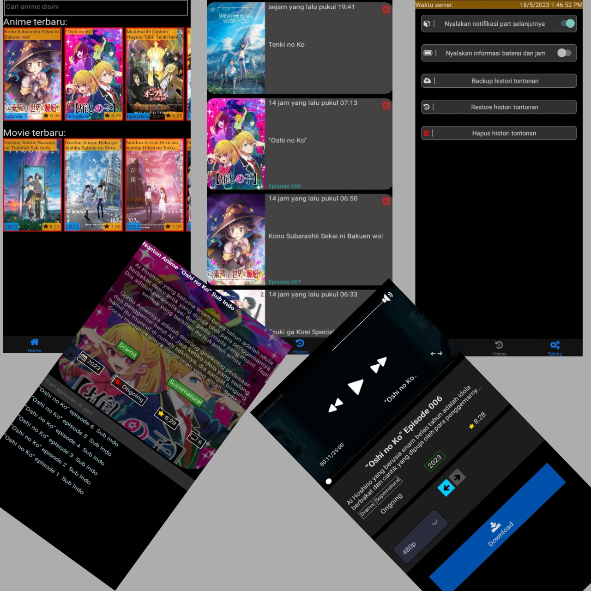

# Aplikasi nonton anime gratis tanpa iklan

Aplikasi streaming anime gratis tanpa iklan, open source!

**_Written in typescript built with react native_** :heart:

## Lengkap dan terbaru!

Tonton anime favorit mu sekarang! Episode lengkap dan terbaru.

## Mudah digunakan

Target utama kami adalah UI yang simpel dan mudah digunakan.

Download episode anime dengan satu klik. Tonton tanpa login!

# Cara Download

Kamu bisa download aplikasi dengan cara berikut ini:

- Pergi ke [Halaman rilis](https://github.com/FightFarewellFearless/anime-react-native/releases)
- Pilih rilis terbaru
- Klik bagian **assets**
- Pilih file **anime.apk**

# FAQ

> Q: Apakah aplikasi ini sepenuh nya gratis?

A: ya, aplikasi ini sepenuh nya gratis, kami tidak mendapatkan keuntungan sedikit pun.

> Q: jika tidak dapat keuntungan bagaimana bisa server tetap berjalan?

A: server kami dijalankan di versi gratis [replit](https://replit.com), jadi tidak ada biaya yang dikeluarkan untuk hosting server

> Q: Dimana video yang sudah saya download berada?

A: video yang sudah di download bisa kamu temukan di `Penyimpanan Internal/Download/`

> Q: Mengapa ada anime yang diblokir?

A: Kami memblokir anime dengan genre ecchi dan hentai. Tapi ada beberapa anime bergenre ecchi yang diizinkan untuk tayang

# Catatan

- Kami memblokir anime dengan genre ecchi dan hentai agar aplikasi aman untuk semua usia
- Video yang terdapat di aplikasi bukan berasal dari server kami.
Semua video berasal dari server pihak ke tiga dan kami tidak punya akses sama sekali.

# LICENSE

&copy; 2023 pirles, This project is licensed under [Creative Commons Attribution Non-Commercial (CC BY-NC) license](https://creativecommons.org/licenses/by-nc/4.0/)

You are allowed to:
* Distribute (copy and share) the project.
* Use the project for non-commercial purposes
* Modify the project as long as proper credit is given to the original copyright owner

But you are not allowed to:

* Using the project for commercial purposes (making money)
* Selling the project or derivatives of the project
* Claiming ownership of the project
