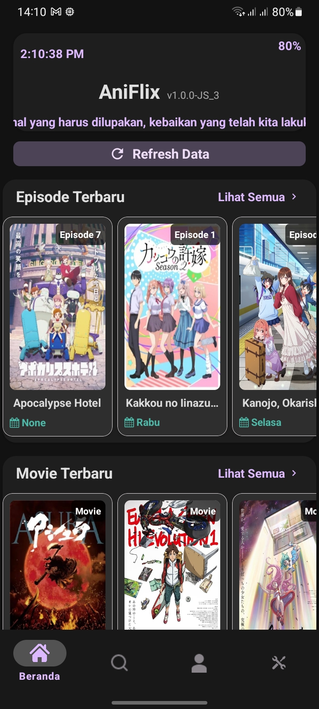
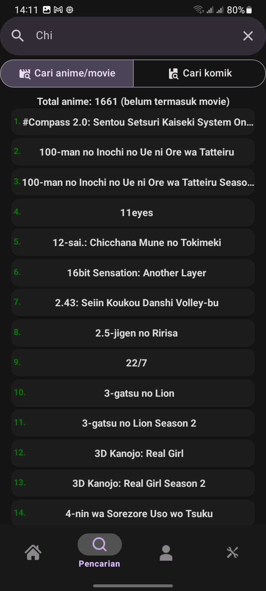

# AniFlix

<p align="center">
  
</p>

<h1 align="center">AniFlix</h1>

<p align="center">
  <i>All-in-one!</i> Satu Aplikasi untuk nonton anime dan baca komik.
  <br />
  <strong><i>Written in TypeScript, built with React Native</i></strong> ❤️
</p>

<p align="center">
  <a href="https://github.com/FightFarewellFearless/aniflix/blob/main/LICENSE">
    
  </a>
  <a href="https://github.com/FightFarewellFearless/aniflix/releases/latest">
    
  </a>
  <a href="https://reactnative.dev/">
    
  </a>
  <a href="https://github.com/FightFarewellFearless/aniflix/languages/top">
    
  </a>
</p>

---

## 🌟 Fitur Utama

| Fitur | Deskripsi |
| :--- | :--- |
| ✨ **Lengkap dan Terbaru** | Tonton anime dan baca komik favoritmu dengan episode dan chapter yang selalu <i>up-to-date</i>. |
| 📱 **Satu aplikasi untuk semua** | Mau nonton anime, movie, atau baca Manga/Manhwa/Manhua? AniFlix menyediakan semua nya! |
| 🎨 **UI Simpel & Modern** | Antarmuka yang bersih dan intuitif untuk pengalaman menonton terbaik. |
| 📥 **Download Sekali Klik** | Unduh episode favoritmu dan tonton secara offline tanpa ribet. |
| 🚫 **Bebas Iklan** | Nikmati pengalaman menonton tanpa gangguan iklan dari kami. |
| 💻 **Open Source** | Berkontribusi dan lihat kode kami di GitHub. Sepenuhnya transparan! |

---

## 📸 Tampilan Aplikasi

| Home | Detail Anime | Daftar Anime | Pemutar Video |
| :---: | :---: | :---: | :---: |
|  |  |  |  |

---

## 🚀 Cara Instalasi

Dapatkan versi terbaru dari AniFlix dengan mudah:

1.  Buka halaman **[Rilis Terbaru](https://github.com/FightFarewellFearless/AniFlix/releases)**.
2.  Pilih rilis yang paling baru (ada di paling atas).
3.  Klik pada bagian **Assets** untuk melihat file.
4.  Unduh file `aniflix.apk` dan instal di perangkat Android Anda.

* **Minimum OS**: Android 7.0 (Nougat) atau yang lebih baru.

---

## ❓ FAQ (Pertanyaan Umum)

> **Q: Apakah aplikasi ini sepenuhnya gratis?**
>
> **A:** Ya, 100% gratis. Kami tidak mengambil keuntungan sama sekali dari aplikasi ini.

> **Q: Saya tidak bisa terhubung ke server!**
>
> **A:** Coba ubah pengaturan DNS di perangkat Anda ke `8.8.8.8` atau `1.1.1.1`. Jika masalah berlanjut, silakan bergabung dengan server Discord kami untuk bantuan lebih lanjut: **[Gabung Discord](https://discord.gg/sbTwxHb9NM)**.

> **Q: Di mana video yang sudah saya download disimpan?**
>
> **A:** Video yang telah diunduh dapat ditemukan di direktori `Penyimpanan Internal/Download/` pada perangkat Anda.

---

## ❤️ Dukung Proyek Ini

AniFlix akan selalu gratis dan open-source. Jika Anda merasa aplikasi ini bermanfaat dan ingin mendukung pengembangan lebih lanjut, Anda bisa memberikan donasi melalui:

<p align="center">
  <a href="https://saweria.co/pirles">
    
  </a>
  <a href="https://trakteer.id/pirles">
    
  </a>
</p>

---

## 📝 Catatan Penting

-   **Sumber Video dan Data**: Video dan data apapun yang ditampilkan dalam aplikasi ini berasal dari server pihak ketiga. Kami tidak memiliki kontrol atau akses sama sekali terhadap konten tersebut.
-   **Kebijakan Konten**: Kami tidak menyimpan file video apa pun di server kami. Aplikasi ini hanya berfungsi sebagai jembatan untuk mengakses konten yang sudah tersedia secara publik di internet.
- **Kepemilikan Konten**: Pengembang aplikasi ini tidak memiliki, menghosting, atau menyimpan konten apa pun yang ditampilkan di dalam aplikasi. Semua konten (video, gambar, teks) diambil dari sumber pihak ketiga yang tersedia secara publik di internet melalui teknik web scraping.
- **Tanggung Jawab Pengguna**: Penggunaan aplikasi ini untuk mengakses konten berhak cipta mungkin ilegal di wilayah hukum Anda. Pengguna bertanggung jawab penuh atas segala tindakan yang dilakukan dengan aplikasi ini. Pengembang tidak bertanggung jawab atas penyalahgunaan atau pelanggaran hak cipta yang dilakukan oleh pihak ketiga.
- **Hak Cipta**: Semua hak kekayaan intelektual, merek dagang, dan hak cipta dari konten yang diakses adalah milik dari pemilik aslinya masing-masing. Proyek ini tidak berafiliasi dengan penyedia konten tersebut.
- Kami sangat menyarankan pengguna untuk mendukung industri anime dengan menonton melalui platform resmi yang berlisensi (seperti Crunchyroll, Netflix, Muse Asia, Bilibili, dll.) jika tersedia di wilayah Anda.

---

## ⚖️ Penafian Hukum (Legal Disclaimer)

Proyek ini, **AniFlix**, dibuat hanya untuk **tujuan pendidikan, penelitian, dan pembelajaran** pengembangan aplikasi mobile menggunakan React Native. Dengan menggunakan atau mengakses repositori ini, Anda menyetujui poin-poin hukum berikut:

### 1. Ketiadaan Hosting Konten
AniFlix tidak menghosting, menyimpan, atau mengunggah konten video, gambar, atau teks apa pun di server mana pun. Aplikasi ini murni merupakan alat *client-side* yang melakukan teknik *web scraping* pada situs publik yang tersedia di internet. Segala konten yang ditampilkan dalam aplikasi diambil secara langsung dari sumber pihak ketiga yang tidak berafiliasi dengan pengembang proyek ini.

### 2. Tanggung Jawab Pengguna
Pengembang (saya) tidak bertanggung jawab atas bagaimana pengguna akhir menggunakan alat ini. Penggunaan aplikasi ini untuk mengakses konten berhak cipta mungkin dianggap ilegal di wilayah hukum Anda. Segala konsekuensi hukum yang timbul dari penggunaan aplikasi ini menjadi tanggung jawab penuh pengguna masing-masing.

### 3. Hak Kekayaan Intelektual
Semua hak cipta, merek dagang, dan materi berhak cipta lainnya (seperti judul anime, karakter, video, dan poster) adalah milik dari pemilik sahnya masing-masing. Proyek ini tidak memiliki hak atas konten tersebut dan tidak bermaksud untuk melanggar hak-hak tersebut.

### 4. Kebijakan DMCA & Penghapusan
Karena aplikasi ini tidak menyimpan konten apa pun, permintaan penghapusan konten (DMCA) harus ditujukan langsung kepada penyedia layanan hosting atau situs web sumber aslinya. Namun, jika ada bagian dari kode sumber (source code) ini yang dianggap melanggar hukum, pemilik hak cipta dapat menghubungi pengembang untuk mendiskusikan penghapusan kode tersebut dari repositori ini.

### 5. Tanpa Jaminan (No Warranty)
Perangkat lunak ini disediakan "APA ADANYA" (AS-IS), tanpa jaminan dalam bentuk apa pun. Mengingat aplikasi ini bergantung pada struktur situs web pihak ketiga, fungsionalitas aplikasi dapat terhenti sewaktu-waktu tanpa pemberitahuan jika situs sumber melakukan perubahan teknis.

---
**Dukung Industri Resmi:** Kami sangat menyarankan pengguna untuk menonton anime melalui platform resmi yang berlisensi (seperti Crunchyroll, Netflix, Muse Asia, Bilibili, dll.) untuk mendukung para kreator dan industri anime.

---

# Build from Source

To build the application from source, first, follow the instructions in the [React Native environment setup guide](https://reactnative.dev/docs/environment-setup?guide=native).

Next, clone this GitHub repository using:
```bash
git clone https://github.com/FightFarewellFearless/AniFlix
```
Wait until the download is complete, then navigate to the project directory:
```bash
cd AniFlix
```
You will also need to create your own keystore. [Follow these steps in the React Native documentation](https://reactnative.dev/docs/signed-apk-android#generating-an-upload-key)

Now you are ready to build! Just one last step remains. Install the required npm dependencies (required of using yarn):
```bash
yarn install
```

:tada: You're all set up! It's time to build. Run the following command:
```bash
cd android
./gradlew assembleRelease
```
Wait for the build to complete. If successful, you can find the APK in `android/app/build/outputs/apk/release`

# LICENSE

Copyright (c) 2026 FightFarewellFearless

Permission is hereby granted, free of charge, to any person obtaining a copy of this software and associated documentation files (the "Software"), to deal in the Software without restriction, including without limitation the rights to use, copy, modify, merge, publish, distribute, sublicense, and/or sell copies of the Software, and to permit persons to whom the Software is furnished to do so, subject to the following conditions:

The above copyright notice and this permission notice shall be included in all copies or substantial portions of the Software.

THE SOFTWARE IS PROVIDED "AS IS", WITHOUT WARRANTY OF ANY KIND, EXPRESS OR IMPLIED, INCLUDING BUT NOT LIMITED TO THE WARRANTIES OF MERCHANTABILITY, FITNESS FOR A PARTICULAR PURPOSE AND NONINFRINGEMENT. IN NO EVENT SHALL THE AUTHORS OR COPYRIGHT HOLDERS BE LIABLE FOR ANY CLAIM, DAMAGES OR OTHER LIABILITY, WHETHER IN AN ACTION OF CONTRACT, TORT OR OTHERWISE, ARISING FROM, OUT OF OR IN CONNECTION WITH THE SOFTWARE OR THE USE OR OTHER DEALINGS IN THE SOFTWARE.

